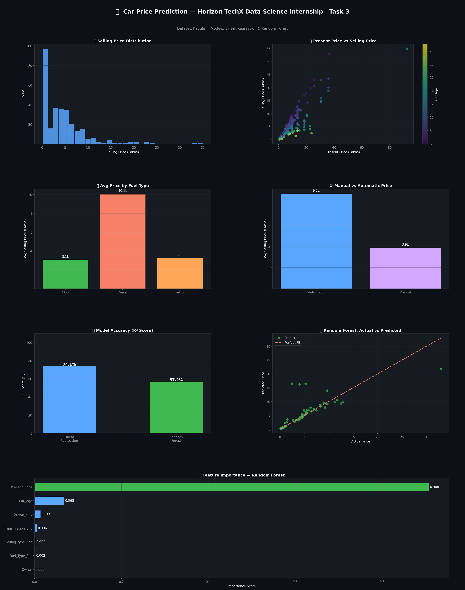

# 🚗 Car Price Prediction Using Machine Learning
### Horizon TechX Data Science Internship — Task 3

---

## 📌 Project Overview
This project builds a machine learning model to predict car prices based on features
like brand value, mileage, engine power, fuel type, and transmission type using
regression algorithms.

## 📸 Dashboard Preview


## 📁 Project Structure
```
HorizonTechX_CarPricePrediction/
│
├── Car_Price_Prediction.ipynb    # Main Jupyter Notebook (run this!)
├── car_price_prediction.py       # Python script version
├── car_data.csv                  # Dataset
├── Car_Price_Dashboard.png       # Static Dashboard Image
└── README.md                     # Project Documentation
```

## 📊 Steps Covered
1. Data Loading & Exploration
2. Data Preprocessing & Feature Engineering (Car Age, Label Encoding)
3. Exploratory Data Analysis (EDA) — 6 visualizations
4. Model Building — Linear Regression & Random Forest Regressor
5. Model Evaluation — MAE, RMSE, R² Score
6. Feature Importance Analysis

## 📊 Visualizations Included
**EDA Dashboard:**
- Selling Price Distribution
- Present Price vs Selling Price (colored by Car Age)
- Average Price by Fuel Type
- Manual vs Automatic Price Comparison
- Car Age vs Selling Price
- Top 10 Cars by Average Selling Price

**Model Evaluation Dashboard:**
- Model Accuracy Comparison (R² Score)
- Error Comparison (MAE & RMSE)
- Actual vs Predicted Values (Random Forest)
- Feature Importance Ranking

## 🛠️ Libraries Used
- Python 3
- Pandas
- NumPy
- Scikit-learn
- Plotly

## 🚀 How to Run

### Option 1 — Google Colab (Recommended)
1. Open [colab.research.google.com](https://colab.research.google.com)
2. Upload `car_data.csv`
3. Paste the code from `Car_Price_Prediction.ipynb`
4. Run — both dashboards appear!

### Option 2 — Jupyter Notebook
1. Put all files in same folder
2. Install dependencies:
   ```
   pip install pandas numpy scikit-learn plotly
   ```
3. Run `Car_Price_Prediction.ipynb`

## 📂 Dataset Source
Kaggle: https://www.kaggle.com/datasets/vijayaadithyanvg/car-price-predictionused-cars

## 🔑 Key Results
- **Best Model:** Linear Regression (R² Score: 74.1%)
- Random Forest achieved R² Score: 57.2% on this dataset
- **Present Price** is the most dominant feature in predicting car selling price
- Diesel and automatic cars tend to have higher resale value

## 👤 Author

**Vasu Singhal** — B.Tech CSE (Data Science) — Bennett University — Horizon TechX Data Science Intern

[](https://www.linkedin.com/in/vasu-singhal-46659a310)
[](https://github.com/Vasu-singhal01)

## 📄 License
MIT License — free to use and modify.
